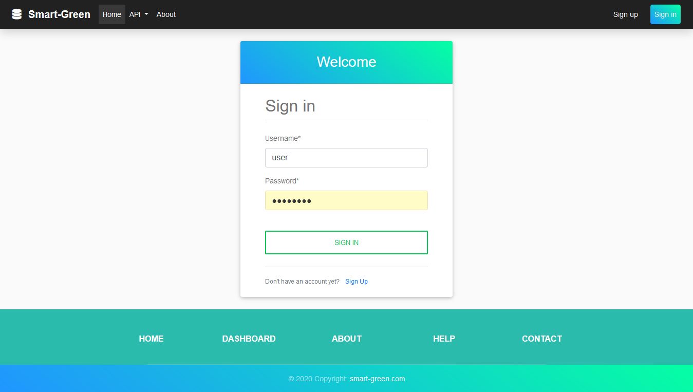
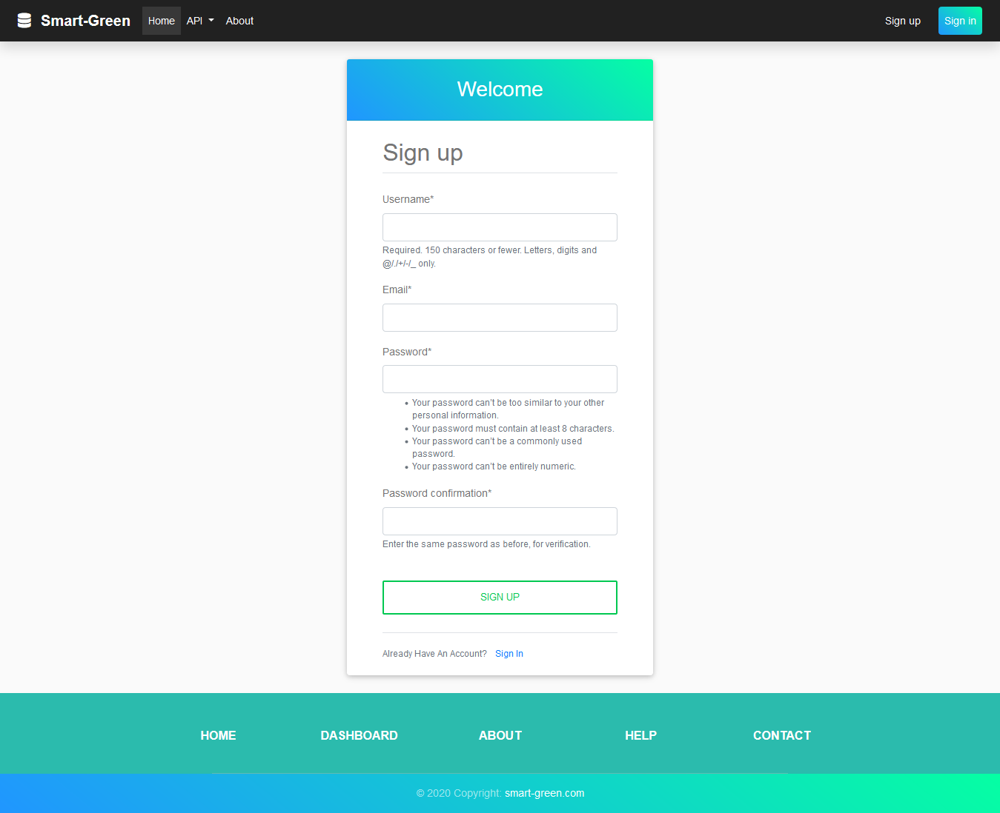
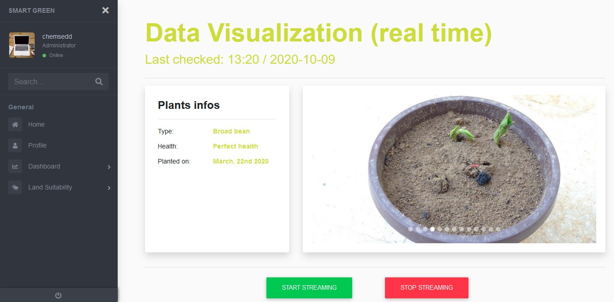
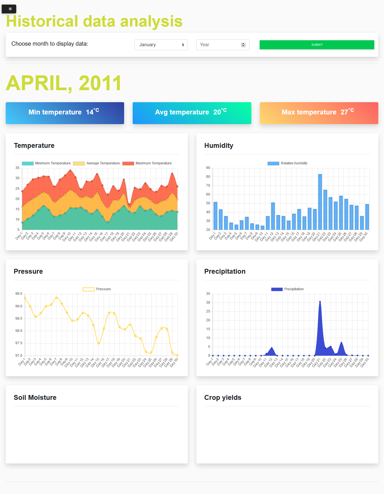
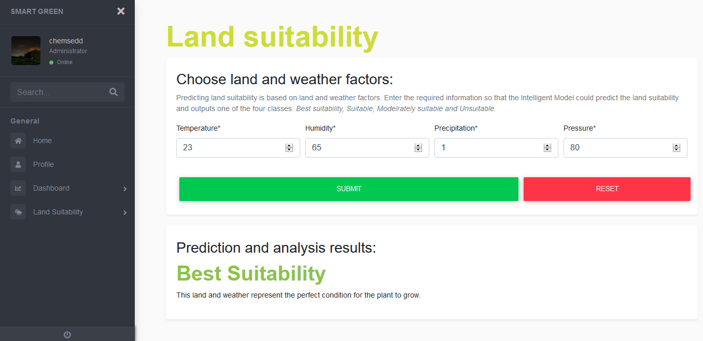

# Smart Green

## Introduction

Smart Green is a web application that provides real time monitoring of farming fields. It's a dashboard of a 3 layers systems that is connected to a data collection layer, consists of Raspberry Pi and Arduino. The dashboard allows users to visualize in real time data retrieved from the field (forcast and soil properties), it also provides access to a database of historical data, and the most important service is predicting land suitability based on the retrieved data.

## Technologies

- **Python 3.8**: We used [Python](https://www.python.org) for creating the app and the deep learning model (LSTM).
- **Django**: the app was developed using [Django](hhttps://www.djangoproject.com/), which is a python based framework.
- **Chart.js**: For creating plots and charts, we used the [Chart.js](https://www.chartjs.org/)

## Run

#### Add Bootstrap 4

Download Bootstrap 4 and Font Awesome and place them under the `sg_home\static\`.

#### Download required libraries

```bash
pip install pandas tensorflow django uvicorn kafka-python
```

#### Run application through Uvicorn backend server

```bash
uvicorn smart_green.asgi:application
```

## Login



## Signup



## Real time data visualization



## Historical data visualization



## Land Suitability prediction


